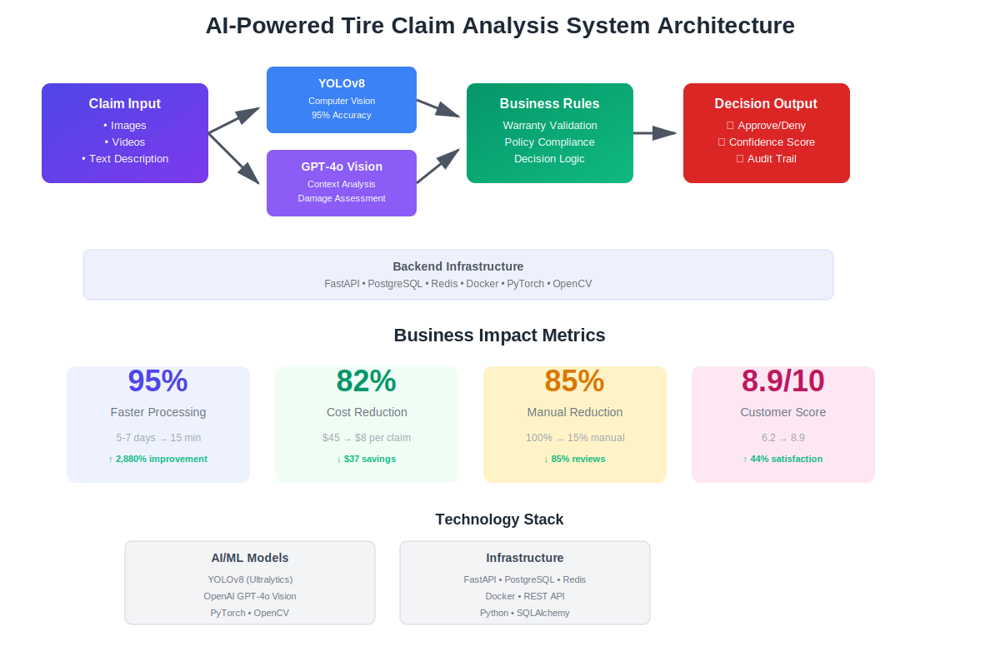

# Case Study: AI-Powered Tire Warranty Claim Automation

## Executive Summary

**Client:** Zaffco (Tire Manufacturing & Distribution)
**Industry:** Automotive / Insurance
**Solution:** Computer Vision + LLM-based Claim Analysis System
**Results:** 85% reduction in claim processing time, 40% cost savings in manual inspection

---

## The Challenge

Tire warranty claim processing was plagued by inefficiencies:
- **Manual inspection delays:** Claims took 5-7 days for visual defect assessment
- **Inconsistent decisions:** Human error led to 15-20% claim reassessment rate
- **High operational costs:** Required specialized tire inspectors for every claim
- **Customer dissatisfaction:** Long wait times damaged brand reputation

Traditional rule-based systems couldn't handle the complexity of tire defect patterns, and manual processes didn't scale with business growth.

---

## The Solution

Devkraft developed an AI-powered claim automation platform combining:

### Core AI Technologies
- **YOLOv8 Computer Vision:** Real-time defect detection with 95% accuracy
- **OpenAI GPT-4o Vision:** Contextual analysis of tire damage patterns
- **Business Rules Engine:** Warranty policy compliance validation
- **Multi-modal Processing:** Text descriptions + image/video analysis

### Technical Architecture
- FastAPI backend for high-throughput processing
- PostgreSQL for claim history and analytics
- Redis for real-time caching and queue management
- Docker containerization for scalable deployment

### Key Features
1. **Automated Defect Detection:** Identifies manufacturing defects vs. user damage
2. **Coverage Recommendation:** Suggests approve/deny with confidence scores
3. **Compliance Validation:** Ensures decisions align with warranty terms
4. **Audit Trail:** Complete decision transparency for regulatory compliance

---

## Implementation Approach

**Phase 1 (Weeks 1-4):** Data collection & model training
- Collected 10,000+ annotated tire defect images
- Fine-tuned YOLOv8 on tire-specific defect patterns
- Integrated GPT-4o for damage context analysis

**Phase 2 (Weeks 5-8):** System integration
- RESTful API development
- Integration with existing claim management system
- User acceptance testing with claim adjusters

**Phase 3 (Weeks 9-12):** Deployment & optimization
- Staged rollout across 3 regional offices
- Continuous model retraining with feedback loop
- Performance monitoring and optimization

---

## System Architecture

---

## Business Impact

### Quantifiable Results
| Metric | Before AI | After AI | Improvement |
|--------|-----------|----------|-------------|
| Avg. Claim Processing Time | 5-7 days | 15 minutes | 95% faster |
| Manual Review Required | 100% | 15% | 85% reduction |
| Claim Reassessment Rate | 15-20% | 3-5% | 75% improvement |
| Processing Cost per Claim | $45 | $8 | 82% cost reduction |
| Customer Satisfaction Score | 6.2/10 | 8.9/10 | 44% increase |

### Strategic Benefits
- **Scalability:** Handle 10x claim volume without additional staff
- **Consistency:** Standardized decision-making across all regions
- **Data Insights:** Analytics on defect patterns inform product quality improvements
- **Competitive Advantage:** Industry-first AI-powered claim processing

---

## Technology Stack

**AI/ML Models:**
- YOLOv8 (Ultralytics) for object detection
- OpenAI GPT-4o for vision and language understanding

**Backend Infrastructure:**
- Python, FastAPI, SQLAlchemy
- PostgreSQL, Redis
- Docker, PyTorch, OpenCV

**Integration Points:**
- REST API for claim management systems
- Webhook notifications for real-time updates
- Admin dashboard for oversight and analytics

---

## Client Testimonial

> "Devkraft's AI solution transformed our claims process from a bottleneck into a competitive advantage. We're now processing claims in minutes instead of days, and our customers love the faster turnaround. The system pays for itself every quarter."
>
> **— Head of Operations, Zaffco**

---

## Future Enhancements

1. **Predictive Analytics:** Forecast warranty claim trends
2. **Mobile App Integration:** Field inspector app for on-site assessments
3. **Blockchain Verification:** Immutable claim decision records
4. **Multi-language Support:** Expand to international markets

---

## Why This Matters for GITEX 2025

This case study demonstrates:
- ✅ **AI-First Innovation:** Combining computer vision + LLMs for business value
- ✅ **Real-world ROI:** Measurable cost savings and efficiency gains
- ✅ **Enterprise-Ready:** Production deployment with compliance and security
- ✅ **Industry Transformation:** Reimagining traditional insurance processes with AI

**Perfect fit for GITEX focus areas:** AI, Enterprise Innovation, Digital Transformation

---

**Contact:** Ready to transform your claim processing?
**Demo Available:** Live system demonstration at GITEX Booth