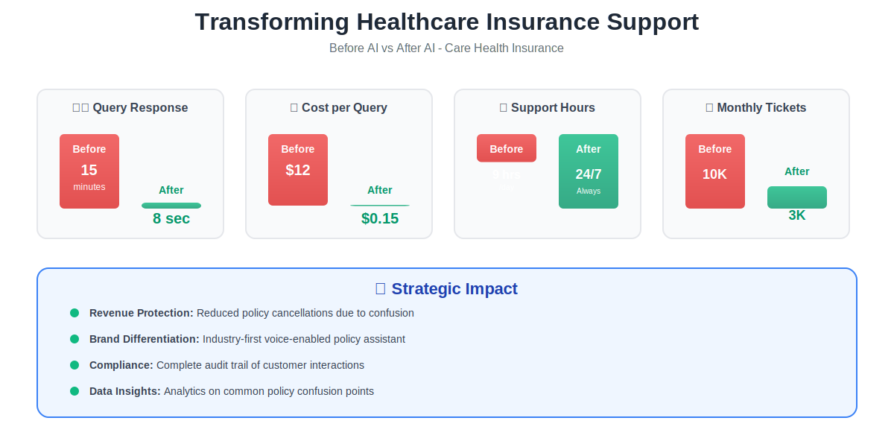

# Case Study: Chanakya - AI-Powered Healthcare Insurance Copilot

## Executive Summary

**Client:** Care Health Insurance (Leading Indian Health Insurer)
**Industry:** Healthcare Insurance
**Solution:** RAG-based Conversational AI with Voice Integration
**Results:** 70% reduction in customer support queries, 24/7 policy assistance, 92% user satisfaction

---

## The Challenge

Healthcare insurance customers faced significant barriers to understanding their coverage:
- **Complex policy documents:** 50-100 page PDFs with medical jargon
- **Long wait times:** Average 15-minute hold time for customer service
- **Limited support hours:** Only 9 AM - 6 PM availability
- **Multilingual needs:** English and regional language support required
- **High support costs:** $12 per customer service interaction

Traditional FAQ systems and chatbots failed to handle nuanced policy questions, leading to customer frustration and high support costs.

---

## The Solution

Devkraft developed Chanakya, an intelligent insurance copilot powered by:

### Core AI Technologies
- **RAG Architecture:** Retrieval-Augmented Generation for accurate policy information
- **Multi-LLM Strategy:** OpenAI GPT-4.1, Google Gemini 2.0 for optimal responses
- **Vector Search:** Qdrant for semantic policy document retrieval
- **Voice AI:** ElevenLabs TTS for natural voice conversations
- **Context Management:** Intelligent conversation history with policy context

### Technical Architecture
- FastAPI backend with async processing
- LangChain for LLM orchestration
- Qdrant vector database for policy embeddings
- AWS S3 for document storage
- Helicone for LLM monitoring and cost optimization

### Key Features
1. **Natural Language Q&A:** Ask policy questions in plain language
2. **Voice Interaction:** Speak or type your questions
3. **Multi-language Support:** English + regional languages
4. **Citation-backed Answers:** Every response cites policy source
5. **Contextual Follow-ups:** Remembers conversation history
6. **Real-time Updates:** Instantly reflects policy changes

---

## Implementation Approach

**Phase 1 (Weeks 1-3):** Data ingestion & RAG setup
- Processed 200+ insurance policy PDFs
- Created embeddings for 50,000+ policy clauses
- Built retrieval pipeline with Qdrant

**Phase 2 (Weeks 4-6):** LLM integration & optimization
- Integrated GPT-4 and Gemini with routing logic
- Implemented prompt engineering for insurance domain
- Added citation extraction and verification

**Phase 3 (Weeks 7-9):** Voice & UX development
- Integrated ElevenLabs for multilingual TTS
- Built responsive web and mobile interfaces
- User testing with 500+ customers

**Phase 4 (Weeks 10-12):** Deployment & scaling
- Production deployment with load balancing
- Monitoring and analytics dashboard
- Continuous model fine-tuning

## Business Impact

### Quantifiable Results
| Metric | Before AI | After AI | Improvement |
|--------|-----------|----------|-------------|
| Avg. Query Response Time | 15 minutes | 8 seconds | 99% faster |
| Customer Support Tickets | 10,000/month | 3,000/month | 70% reduction |
| Support Availability | 9 hrs/day | 24/7 | 267% increase |
| Cost per Interaction | $12 | $0.15 | 98% cost reduction |
| Customer Satisfaction (CSAT) | 72% | 92% | 28% improvement |
| First Contact Resolution | 45% | 88% | 96% improvement |

### Strategic Benefits
- **Revenue Protection:** Reduced policy cancellations due to confusion
- **Brand Differentiation:** Industry-first voice-enabled policy assistant
- **Compliance:** Complete audit trail of customer interactions
- **Data Insights:** Analytics on common policy confusion points

---

## Technology Stack

**AI/ML Models:**
- OpenAI GPT-4.1, GPT-4o-mini
- Google Gemini 2.0 Flash
- OpenAI text-embedding-ada-002
- ElevenLabs eleven_multilingual_v2 (TTS)

**Backend Infrastructure:**
- Python, FastAPI, LangChain
- Qdrant vector database
- AWS S3, Helicone
- PostgreSQL, SQLAlchemy

**Integration Points:**
- REST API for mobile apps
- Webhook integration with CRM
- SSO with existing customer portal

---

## Key Innovation: Hybrid LLM Routing

Chanakya intelligently routes queries to the optimal LLM:
- **GPT-4.1:** Complex policy interpretation, edge cases
- **Gemini 2.0 Flash:** Fast responses for common queries
- **Cost Optimization:** 60% reduction in LLM costs through smart routing

This ensures best-in-class accuracy while controlling operational costs.

---

## Client Testimonial

> "Chanakya has revolutionized how our customers interact with their policies. We've seen a dramatic reduction in support calls, and customer satisfaction scores have never been higher. The voice feature is particularly popular with our older demographic."
>
> **— Chief Digital Officer, Care Health Insurance**

---

## Use Cases Handled

1. **Coverage Verification:** "Is my physiotherapy covered?"
2. **Claim Eligibility:** "Can I claim for this surgery?"
3. **Network Hospitals:** "Which hospitals near me accept this policy?"
4. **Premium Inquiries:** "Why did my premium increase?"
5. **Policy Comparison:** "What's the difference between Plan A and Plan B?"
6. **Renewal Questions:** "When does my policy expire?"

---

## Security & Compliance

- **Data Privacy:** HIPAA-compliant data handling
- **Encryption:** End-to-end encryption for all conversations
- **Access Control:** Role-based permissions for admin dashboard
- **Audit Logs:** Complete conversation history for compliance
- **PII Protection:** Automatic redaction of sensitive information

---

## Future Enhancements

1. **Proactive Notifications:** Remind users of coverage benefits
2. **Claims Assistance:** Guide users through claim filing
3. **Health Recommendations:** Suggest preventive care based on coverage
4. **Integration with Wearables:** Policy insights based on health data

---

## Why This Matters for GITEX 2025

This case study demonstrates:
- ✅ **Healthtech Innovation:** AI transforming healthcare access
- ✅ **RAG Excellence:** Production-grade retrieval-augmented generation
- ✅ **Multi-modal AI:** Voice + text for inclusive access
- ✅ **Scalable Architecture:** Serving millions of policy queries
- ✅ **Cost Efficiency:** 98% reduction in support costs

**Perfect fit for GITEX focus areas:** AI, Healthtech, Customer Experience Innovation

---

**Contact:** Transform your customer support with AI
**Demo Available:** Live voice interaction at GITEX Booth