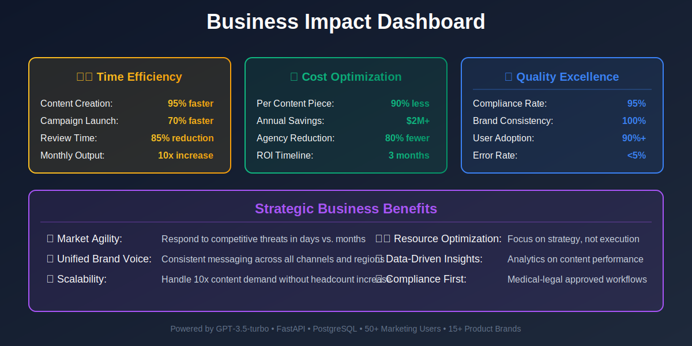

# Case Study: Content AI - Pharmaceutical Marketing Automation

## Executive Summary

**Client:** Leading Global Pharmaceutical Company (Indegene Portfolio)
**Industry:** Pharmaceutical / Life Sciences Marketing
**Solution:** AI-Powered Content Generation with Brand Compliance
**Results:** 10x content production speed, 95% compliance rate, $2M annual savings

---

## The Challenge

Pharmaceutical marketing teams struggled with content creation bottlenecks:
- **Regulatory complexity:** Every piece requires medical-legal review
- **Slow turnaround:** 2-3 weeks for a single email campaign
- **Brand consistency:** 200+ products across 50+ markets
- **Content personalization:** Different audiences (HCPs, patients, payers)
- **High production costs:** $5,000-$10,000 per content piece
- **Compliance risk:** Non-compliant content could cost millions in fines

Traditional content agencies couldn't scale with the volume demands, and manual processes created quality inconsistencies.

---

## The Solution

Devkraft developed Content AI, an intelligent content generation platform:

### Core AI Technologies
- **GPT-3.5-turbo & GPT-3.5-turbo-1106:** Optimized for pharma content
- **Rule-based Compliance Engine:** Validates against brand guidelines
- **Content Universe Management:** Structured database of approved claims
- **Template Library:** Pre-approved formats for emails, blogs, social
- **Multi-region Support:** Adapts to local regulatory requirements

### Technical Architecture
- FastAPI backend with async processing
- PostgreSQL for content universe and rules
- Celery for background content generation
- Redis for caching and task queuing
- Docker deployment for scalability

### Key Features
1. **Guided Content Creation:** Step-by-step wizard for non-technical users
2. **Compliance Validation:** Real-time checking against brand rules
3. **Content Universe Integration:** Auto-fills approved claims and data
4. **Multi-format Output:** HTML emails, blog posts, social media
5. **Revision History:** Complete audit trail for regulatory reviews
6. **Batch Generation:** Create multiple variants simultaneously

---

## Implementation Approach

**Phase 1 (Weeks 1-4):** Content universe setup
- Migrated 10,000+ approved claims to database
- Defined brand-specific compliance rules for 15 products
- Created 50+ content templates

**Phase 2 (Weeks 5-8):** AI integration & prompt engineering
- Custom prompt templates for pharma compliance
- GPT fine-tuning on approved content samples
- Compliance validation logic implementation

**Phase 3 (Weeks 9-12):** User testing & refinement
- Training for 50+ marketing users
- A/B testing of AI-generated vs. manual content
- Workflow integration with approval processes

**Phase 4 (Weeks 13-16):** Rollout & scaling
- Phased deployment across 3 business units
- Integration with marketing automation platforms
- Performance monitoring and optimization

---

## Business Impact

### Quantifiable Results
| Metric | Before AI | After AI | Improvement |
|--------|-----------|----------|-------------|
| Content Creation Time | 2-3 weeks | 2-4 hours | 95% faster |
| Cost per Content Piece | $5,000-$10,000 | $500-$800 | 90% cost reduction |
| Content Output (monthly) | 50 pieces | 500+ pieces | 10x increase |
| Compliance Pass Rate | 60% (first draft) | 95% | 58% improvement |
| Medical-Legal Review Time | 3-5 days | 4-8 hours | 85% faster |
| Campaign Launch Speed | 8-10 weeks | 2-3 weeks | 70% faster |

### Strategic Benefits
- **Market Agility:** Respond to competitive threats in days vs. months
- **Consistency:** Unified brand voice across all channels and regions
- **Resource Optimization:** Marketing teams focus on strategy, not execution
- **Scalability:** Handle 10x content demand without headcount increase
- **Data-driven:** Analytics on content performance by segment

**Annual Cost Savings:** $2M+ (reduced agency fees + faster time-to-market)

---

## Technology Stack

**AI/ML Models:**
- OpenAI GPT-3.5-turbo
- OpenAI GPT-3.5-turbo-1106

**Backend Infrastructure:**
- Python, FastAPI, SQLAlchemy
- PostgreSQL, Redis, Celery
- Pandas (Excel processing)
- Sentry (error monitoring)
- Docker, Alembic

**Integration Points:**
- REST API for marketing platforms
- Excel import/export for content universe
- SSO with enterprise identity systems

---

## Compliance Innovation

### Multi-layer Validation
1. **Pre-generation:** Check content universe for approved claims
2. **During generation:** Enforce brand tone and style guidelines
3. **Post-generation:** Flag potential compliance issues
4. **Human-in-the-loop:** Medical-legal review for final approval

### Example Compliance Rules
- ✅ Only use approved efficacy claims
- ✅ Include required fair balance statements
- ✅ Add adverse event reporting information
- ✅ Comply with character limits for each channel
- ✅ Follow regional regulatory requirements

---

## Client Testimonial

> "Content AI has transformed our marketing operations. We're now launching campaigns 10x faster while maintaining the highest compliance standards. Our marketing teams love the creative freedom without the compliance headaches."
>
> **— VP of Global Marketing, Pharmaceutical Client**

---

## Use Cases Delivered

1. **HCP Email Campaigns:** Personalized emails for physicians
2. **Patient Education:** Blog posts explaining treatment benefits
3. **Social Media:** Compliant LinkedIn and Twitter content
4. **Conference Materials:** Speaker notes and booth content
5. **Payer Communications:** Value dossiers and formulary submissions

---

## Content Universe Management

The platform includes a sophisticated content database:
- **Claims Library:** 10,000+ approved product claims
- **Sub-claims:** Supporting evidence and data points
- **References:** Linked clinical trial publications
- **Regional Variations:** Market-specific content adaptations
- **Excel Integration:** Bulk upload/update via templates

This ensures all AI-generated content is grounded in approved, evidence-based information.

---

## Future Enhancements

1. **Multi-language Generation:** Automatic translation with compliance
2. **Image Generation:** AI-created visuals with brand consistency
3. **Video Scripts:** Automated video content creation
4. **Competitive Intelligence:** Monitor and respond to competitor content
5. **Predictive Analytics:** Forecast content performance before launch

---
