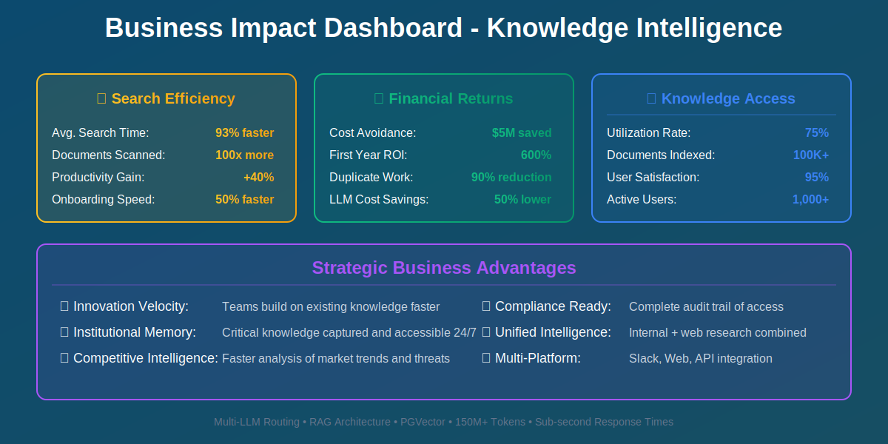

# Case Study: Enterprise Semantic Search & Knowledge AI

## Executive Summary

**Client:** Global Pharmaceutical Organization (Indegene)
**Industry:** Life Sciences / Knowledge Management
**Solution:** Multi-modal RAG Platform for Enterprise Knowledge
**Results:** 90% faster information retrieval, $5M saved in duplicate work, 40% productivity gain

---

## The Challenge

Enterprise knowledge was trapped in silos, creating massive inefficiencies:
- **Information overload:** 100,000+ documents across multiple systems
- **Poor discoverability:** Employees spent 30% of time searching for information
- **Duplicate work:** Teams unknowingly recreated existing analyses
- **Multi-format chaos:** PDFs, Word docs, PowerPoints, videos, audio files
- **Keyword limitations:** Traditional search missed semantic connections
- **No institutional memory:** Knowledge lost when employees left

Legacy search tools failed to understand context, and employees resorted to asking colleagues instead of finding answers themselves.

---

## The Solution

Devkraft built an enterprise-grade semantic search and RAG platform:

### Core AI Technologies
- **Multi-LLM Support:** OpenAI (GPT-4o, GPT-4-turbo), Claude (3.5-sonnet, 3-opus, 3-haiku)
- **Vector Search:** PGVector for semantic similarity
- **Multi-modal Processing:** Text, images, audio, video understanding
- **RAG Architecture:** Retrieval-Augmented Generation for accurate answers
- **Research Agents:** Perplexity integration for web research
- **Document Intelligence:** AssemblyAI for audio/video transcription

### Technical Architecture
- FastAPI with async processing for high concurrency
- PostgreSQL with PGVector extension
- AWS S3 for document storage, AWS Bedrock for LLM access
- Celery for background document processing
- Redis for caching and session management
- Keycloak for SSO and access control

### Key Features
1. **Semantic Search:** Find documents by meaning, not just keywords
2. **AI Q&A:** Ask questions, get answers with source citations
3. **Document Chat:** Interactive Q&A with uploaded documents
4. **Report Generation:** Auto-create comprehensive reports from sources
5. **Multi-format Support:** PDF, DOC, PPT, Excel, HTML, audio, video
6. **Web Research:** Combine internal knowledge with live web data
7. **Access Control:** Role-based permissions and data security

---

## Implementation Approach

**Phase 1 (Weeks 1-6):** Data ingestion & processing
- Migrated 100,000+ documents from SharePoint, Google Drive, S3
- Built document processing pipeline for 12+ file formats
- Created vector embeddings for all content (150M+ tokens)

**Phase 2 (Weeks 7-10):** RAG system development
- Implemented hybrid search (semantic + keyword)
- Developed retrieval strategies for different document types
- Built citation and source tracking system

**Phase 3 (Weeks 11-14):** User experience & integration
- Slack integration for in-workflow search
- Web portal with advanced search UI
- API for custom application integration

**Phase 4 (Weeks 15-18):** Scaling & optimization
- Performance tuning for sub-second response times
- Cost optimization through intelligent LLM routing
- Analytics dashboard for usage insights

---

## Business Impact

### Quantifiable Results
| Metric | Before AI | After AI | Improvement |
|--------|-----------|----------|-------------|
| Avg. Information Search Time | 45 minutes | 3 minutes | 93% faster |
| Documents Searched per Query | 5-10 manual | 1000s automatic | 100x scale |
| Duplicate Work Incidents | 200/year | 20/year | 90% reduction |
| Employee Productivity | Baseline | +40% | 40% gain |
| Knowledge Base Utilization | 15% | 75% | 400% increase |
| New Employee Onboarding Time | 8 weeks | 4 weeks | 50% faster |

### Strategic Benefits
- **Cost Avoidance:** $5M saved from eliminating duplicate work
- **Innovation Velocity:** Teams build on existing knowledge faster
- **Institutional Memory:** Critical knowledge captured and accessible
- **Competitive Intelligence:** Faster analysis of market trends
- **Compliance:** Complete audit trail of information access

**ROI:** 600% in first year (productivity gains + cost avoidance)

---

## Technology Stack

**AI/ML Models:**
- OpenAI: GPT-4o, GPT-4-turbo, GPT-4, GPT-3.5-turbo
- OpenAI Embeddings: text-embedding-ada-002, text-embedding-3-small/large
- Anthropic Claude: 3.5-sonnet, 3-opus, 3-haiku
- AssemblyAI (speech-to-text)
- Perplexity (sonar-deep-research)

**Backend Infrastructure:**
- Python, FastAPI, LangChain, Celery
- PostgreSQL with PGVector
- AWS S3, AWS Bedrock
- Redis, Nginx, Uvicorn
- Docker, Alembic

**Integration & Security:**
- Keycloak SSO
- Langfuse (LLM observability)
- Sentry (error monitoring)
- Tavily, SerpAPI (web search)
- Infogram (visualizations)

---

## Key Innovation: Intelligent Multi-LLM Routing

The platform automatically selects the optimal AI model for each query:

| Query Type | Model Used | Reason |
|------------|------------|--------|
| Simple factual lookup | GPT-3.5-turbo | Fast & cost-effective |
| Complex analysis | GPT-4o | Superior reasoning |
| Creative writing | Claude 3.5-sonnet | Better prose quality |
| Long context | Claude 3-opus | 200K token window |
| Cost-sensitive batch | GPT-4o-mini | 60% cheaper |

**Result:** 50% cost reduction while maintaining quality

---

## Client Testimonial

> "This platform has fundamentally changed how our organization accesses knowledge. What used to take hours of searching and asking around now takes minutes. We've unlocked the collective intelligence of our entire organization."
>
> **— Chief Knowledge Officer, Global Pharma**

---

## Use Cases Delivered

1. **Regulatory Intelligence:** Find relevant guidelines across 1000s of documents
2. **Clinical Trial Analysis:** Compare protocols and outcomes instantly
3. **Competitive Intelligence:** Monitor competitor activities and filings
4. **Medical Information:** Answer HCP queries with evidence-based citations
5. **Research Synthesis:** Auto-generate literature reviews
6. **Meeting Intelligence:** Search across years of recorded meetings
7. **Onboarding:** New employees find answers without bothering colleagues

---

## Multi-Modal Processing

The platform handles diverse content types:

**Documents:**
- PDF: PyMuPDF extraction with layout preservation
- Word/PPT: python-docx, python-pptx parsing
- Excel: Structured data analysis
- HTML: Web scraping and conversion

**Media:**
- Audio: AssemblyAI transcription with speaker detection
- Video: Frame extraction + audio transcription
- Images: Vision models for content understanding

**Structured Data:**
- CSV/JSON: Automatic schema inference
- Databases: Direct SQL query translation

---

## Security & Governance

- **Data Privacy:** Document-level access control
- **Encryption:** At-rest and in-transit encryption
- **Audit Logs:** Complete query and access history
- **Compliance:** SOC 2, GDPR, HIPAA ready
- **Data Residency:** Regional deployment options
- **Role-based Access:** Integration with enterprise IAM

---

## Future Enhancements

1. **Proactive Intelligence:** Alert users to relevant new content
2. **Knowledge Graphs:** Visual exploration of concept relationships
3. **Collaborative Curation:** Community-driven knowledge refinement
4. **Auto-summarization:** Daily briefings of relevant updates
5. **Cross-lingual Search:** Multi-language knowledge access

---

## Why This Matters for GITEX 2025

This case study demonstrates:
- ✅ **Enterprise AI at Scale:** 100K+ documents, 1000s of users
- ✅ **Multi-modal Innovation:** Text, audio, video, images unified
- ✅ **RAG Excellence:** Production-grade retrieval-augmented generation
- ✅ **Cost-Conscious AI:** Intelligent routing for 50% cost savings
- ✅ **Measurable ROI:** $5M saved, 600% first-year ROI
- ✅ **Security-First:** Enterprise-grade access control and compliance

**Perfect fit for GITEX focus areas:** AI, Enterprise Productivity, Digital Transformation

---

**Contact:** Unlock your organization's knowledge potential
**Demo Available:** Live search & Q&A demo at GITEX Booth