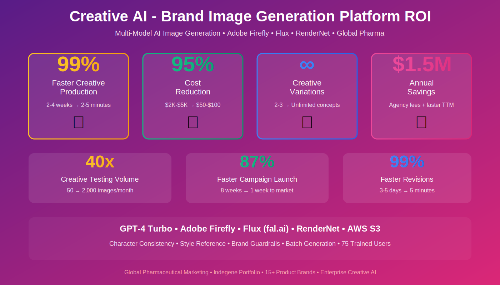

# Case Study: Creative AI - Brand-Compliant Image Generation Platform

## Executive Summary

**Client:** Global Pharmaceutical Marketing Teams (Indegene)
**Industry:** Pharmaceutical / Creative Services
**Solution:** Multi-Model AI Image & Character Generation
**Results:** 95% faster creative production, 80% cost reduction, unlimited brand variations

---

## The Challenge

Pharmaceutical brands faced creative production bottlenecks:
- **Slow turnaround:** 2-4 weeks for custom imagery
- **High costs:** $2,000-$5,000 per image from agencies
- **Limited variations:** Expensive to test multiple creative concepts
- **Brand inconsistency:** Stock photos don't match brand guidelines
- **Character continuity:** Impossible to reuse same people across campaigns
- **Rights management:** Licensing fees and usage restrictions
- **Revision cycles:** Weeks to incorporate feedback

Traditional stock photography lacked brand specificity, and custom photoshoots were prohibitively expensive for most campaigns.

---

## The Solution

Devkraft developed a multi-model AI creative platform:

### Core AI Technologies
- **OpenAI GPT-4 Turbo:** Prompt enhancement and style analysis
- **Adobe Firefly:** Enterprise-grade image generation
- **Flux (fal.ai):** High-quality, diverse image outputs
- **RenderNet:** Consistent character generation across scenes
- **Vision AI:** Analyzes reference images for style transfer
- **Multi-model Orchestration:** Automatic model selection for optimal results

### Technical Architecture
- FastAPI backend with concurrent generation
- PostgreSQL for asset metadata and brand libraries
- AWS S3 for secure image storage
- Adobe IMS integration for enterprise authentication
- Presigned URLs for secure asset access
- ThreadPoolExecutor for parallel processing

### Key Features
1. **Guided Image Creation:** Step-by-step wizard with brand filters
2. **Style Reference Upload:** Match existing brand aesthetics
3. **Character Library:** Create and reuse consistent human characters
4. **Batch Generation:** Create multiple variations simultaneously
5. **Brand Guardrails:** Filter by geography, persona, therapeutic area
6. **Advanced Editing:** Refine prompts with AI assistance
7. **Asset Management:** Organize and track all generated creatives

---

## Implementation Approach

**Phase 1 (Weeks 1-3):** Model integration & testing
- Integrated Adobe Firefly, Flux, and RenderNet APIs
- Tested 500+ prompts across therapeutic areas
- Established quality benchmarks for each model

**Phase 2 (Weeks 4-6):** Brand library setup
- Created brand style guides for 15 products
- Defined filtering parameters (geography, channel, etc.)
- Built reference image database

**Phase 3 (Weeks 7-9):** Character generation system
- Developed character attribute specification UI
- Integrated RenderNet for consistency
- Created character reuse workflow

**Phase 4 (Weeks 10-12):** User rollout
- Trained 75 marketers and designers
- Integrated with marketing automation platforms
- Established governance and approval workflows

---

## Business Impact

### Quantifiable Results
| Metric | Before AI | After AI | Improvement |
|--------|-----------|----------|-------------|
| Image Creation Time | 2-4 weeks | 2-5 minutes | 99% faster |
| Cost per Image | $2,000-$5,000 | $50-$100 | 95% cost reduction |
| Creative Variations | 2-3 per concept | Unlimited | ∞ scale |
| Revision Turnaround | 3-5 days | 5 minutes | 99% faster |
| Campaign Launch Speed | 8 weeks | 1 week | 87% faster |
| Creative Testing Volume | 50 images/month | 2,000 images/month | 40x increase |

### Strategic Benefits
- **Creative Freedom:** Test bold concepts without financial risk
- **Personalization:** Custom imagery for every audience segment
- **Brand Consistency:** AI enforces brand guidelines automatically
- **Market Agility:** Launch region-specific campaigns instantly
- **IP Control:** Own all generated assets without licensing fees
- **Diversity & Inclusion:** Create representative imagery across demographics

**Annual Savings:** $1.5M+ (reduced agency fees + faster time-to-market)

---

## Technology Stack

**AI/ML Models:**
- OpenAI GPT-4 Turbo
- Adobe Firefly
- Flux (fal-ai/flux/dev, fal-ai/flux-pro/v1/canny)
- RenderNet

**Backend Infrastructure:**
- Python, FastAPI, SQLAlchemy
- PostgreSQL, Alembic
- AWS S3, boto3
- Adobe IMS (authentication)
- fal_client (API integration)
- PIL/Pillow (image processing)
- Uvicorn, Pydantic, loguru

**Integration Points:**
- REST API for design tools
- Presigned S3 URLs for secure access
- Adobe Creative Cloud integration (planned)

---

## Key Innovation: Consistent Character Generation

**Challenge:** Traditional AI image generators can't create the same person twice.

**Solution:** RenderNet-powered character library

**How it works:**
1. **Character Creation:** Specify attributes (age, gender, ethnicity, hair, body type)
2. **Base Model Generation:** AI creates consistent base character
3. **Scene Variations:** Place character in different poses, settings, outfits
4. **Library Management:** Save and reuse across campaigns
5. **Team Sharing:** Entire marketing team accesses same characters

**Result:** Cohesive brand storytelling with recognizable "brand ambassadors"

**Example Use Case:**
- Create Dr. Sarah (40s, professional, diverse ethnicity)
- Use Dr. Sarah across 20 different campaign materials
- Maintain visual continuity for brand recognition
- No model fees, unlimited usage rights

---

## Client Testimonial

> "This platform has revolutionized our creative process. We're testing 10x more creative concepts than before, and our campaigns are more personalized and brand-consistent. The character generation feature alone has saved us hundreds of thousands in photography costs."
>
> **— Creative Director, Global Pharma Brand**

---

## Use Cases Delivered

1. **HCP Marketing:** Diverse physicians in clinical settings
2. **Patient Education:** Relatable patients across demographics
3. **Conference Materials:** Brand-specific visuals for booth graphics
4. **Social Media:** Endless content variations for A/B testing
5. **Website Imagery:** Custom hero images and product visualizations
6. **Email Campaigns:** Personalized imagery by audience segment
7. **Product Packaging:** Concept testing for packaging designs

---

## Multi-Model Intelligence

The platform automatically selects the best AI model for each use case:

| Use Case | Primary Model | Why |
|----------|---------------|-----|
| Photorealistic humans | RenderNet | Character consistency |
| Brand lifestyle imagery | Adobe Firefly | Enterprise compliance |
| Artistic concepts | Flux Pro | Creative flexibility |
| Fast iterations | Flux Dev | Speed + quality balance |
| Style matching | GPT-4 + Flux | Reference analysis |

**Cost Optimization:** Intelligent routing reduces generation costs by 40%

---

## Brand Compliance Features

### Multi-dimensional Filtering
- **Brand:** Select from 15+ product brands
- **Geography:** US, EU, APAC-specific imagery
- **Persona:** HCP, Patient, Caregiver
- **Therapeutic Area:** Oncology, Cardiology, etc.
- **Channel:** Digital, Print, Social, Events

### Style Reference Analysis
- Upload existing brand imagery
- GPT-4 Vision analyzes style attributes
- Prompts automatically adjusted to match
- Maintains visual consistency across all assets

### Approval Workflow
- Review queue for brand compliance
- Feedback loop for prompt refinement
- Version history for all generations
- Export to brand asset management systems

---

## Future Enhancements

1. **Video Generation:** Extend to motion graphics and video ads
2. **3D Assets:** Generate product mockups and booth designs
3. **Brand Voice Integration:** Combine with Content AI for complete campaigns
4. **Real-time Editing:** In-browser image refinement
5. **API for Design Tools:** Figma/Adobe plugin integration
6. **Custom Model Training:** Fine-tune on specific brand imagery

---