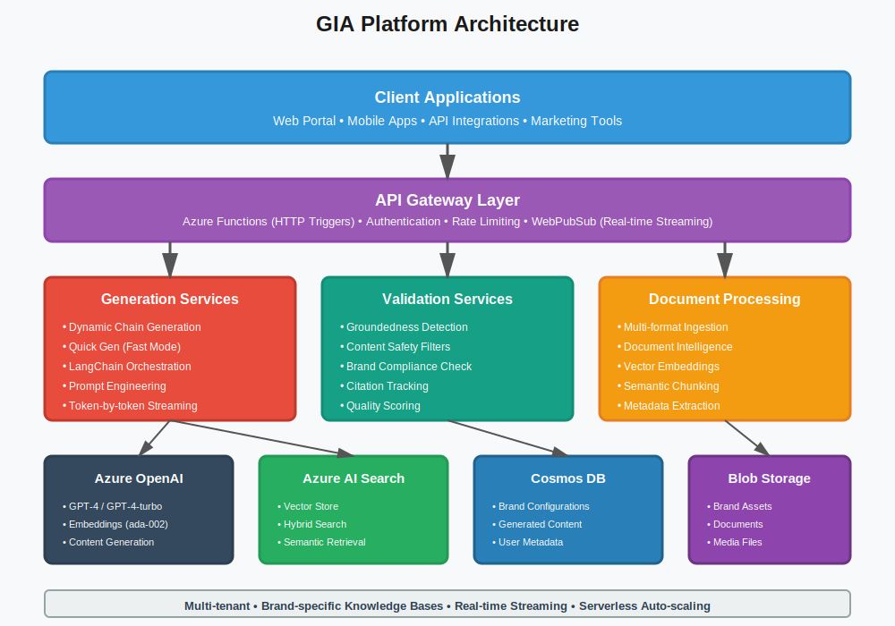

# Case Study: GIA Platform - AI-Powered Marketing Copywriting

## Executive Summary

**Client:** Dentsu (Global Marketing & Advertising Agency)
**Industry:** Marketing Technology / Creative Services
**Solution:** AI-Powered Brand-Compliant Content Generation Platform
**Results:** 90% faster content generation, 100% brand compliance, 60-70% cost reduction

---

## The Challenge

Enterprise marketing teams faced critical bottlenecks in content production:
- **Slow content creation:** 4-6 hours per marketing asset
- **Inconsistent brand voice:** Manual processes led to guideline violations
- **Multi-channel complexity:** Adapting copy for 10+ channels required specialized expertise
- **Scalability limits:** High-volume campaigns overwhelmed creative teams
- **Knowledge silos:** Brand guidelines trapped in PDFs, not accessible during creation
- **High costs:** 60-70% of budget spent on routine copywriting
- **Delayed launches:** Content bottlenecks pushed back campaign go-live dates

Traditional content creation couldn't scale with modern marketing demands, and manual brand compliance checking was error-prone and time-consuming.

---

## The Solution

DevKraft developed GIA, an enterprise AI copywriting platform powered by:

### Core AI Technologies
- **Azure OpenAI GPT-4:** Advanced language generation for marketing copy
- **RAG Architecture:** Retrieval-Augmented Generation with brand knowledge
- **Vector Search:** Azure AI Search for semantic brand guideline retrieval
- **LangChain Orchestration:** Dynamic prompt chains for complex content
- **Groundedness Detection:** Automated fact-checking against brand materials
- **Content Safety:** Multi-layer validation for brand compliance
- **Real-time Streaming:** WebPubSub for token-by-token generation

### Technical Architecture
- Azure Functions (serverless) for auto-scaling
- Azure Cosmos DB for brand assets and metadata
- Azure Blob Storage for document management
- Azure AI Search with hybrid vector+keyword search
- Python + LangChain for LLM orchestration
- Azure Document Intelligence for PDF/DOC processing
- MarkItDown for multi-format content extraction

### Key Features
1. **Multi-channel Generation:** Optimize copy for social, email, ads, web, print
2. **Brand Compliance:** 100% adherence to tone, voice, and guidelines
3. **Quick Gen Mode:** Rapid single-prompt generation in seconds
4. **Dynamic Chains:** Multi-step generation for complex requirements
5. **Multi-brand Support:** Isolated tenants with brand-specific configs
6. **Streaming Output:** Real-time content delivery for better UX
7. **Citation Tracking:** Every claim linked to source documents
8. **Layout Optimization:** Copy adapted to specific creative layouts

---

## Implementation Approach

**Phase 1 (Weeks 1-2):** Discovery & planning
- Brand audit and guideline cataloging
- Workflow analysis and pain point identification
- Technical infrastructure assessment
- Success criteria definition

**Phase 2 (Weeks 3-4):** Infrastructure setup
- Azure resource provisioning (Functions, Cosmos, AI Search, Blob)
- Security configuration and managed identities
- CI/CD pipeline with GitHub Actions
- Monitoring and observability setup

**Phase 3 (Weeks 5-6):** Knowledge base development
- Document processing (brand guides, product info, examples)
- Vector embedding generation for 50,000+ content chunks
- Metadata enrichment and categorization
- Hybrid search index optimization

**Phase 4 (Weeks 7-8):** Prompt engineering
- Brand-specific template development
- Chain configuration for multi-step workflows
- A/B testing of prompt variations
- Quality optimization based on stakeholder feedback

**Phase 5 (Weeks 9-10):** Testing & validation
- Functional testing across all generation modes
- Performance testing and load simulation
- Human quality evaluation against brand standards
- Security and compliance audits

**Phase 6 (Weeks 11-12):** Pilot launch
- User onboarding and training
- Feedback collection and iteration
- Prompt refinement based on real usage
- Success metrics tracking

**Phase 7 (Week 13+):** Full deployment
- Organization-wide rollout
- Continuous monitoring and optimization
- Regular content updates and model improvements

---

## System Architecture

---

## Business Impact

### Quantifiable Results
| Metric | Before AI | After AI | Improvement |
|--------|-----------|----------|-------------|
| Content Generation Time | 4-6 hours | 15-30 minutes | 90% faster |
| Brand Compliance Rate | 80-85% | 100% | 18% improvement |
| Content Production Cost | $120/asset | $35/asset | 70% reduction |
| Campaign Launch Time | 4-6 weeks | 1-2 weeks | 66% faster |
| Copy Variations per Hour | 2-3 | 20-30 | 800% increase |
| Team Productivity | Baseline | +300% | 3x output |

### Strategic Benefits
- **Creative Liberation:** Marketers focus on strategy instead of routine writing
- **Scalability:** Handle 10x content volume without additional headcount
- **Brand Consistency:** Centralized brand intelligence across all touchpoints
- **Agility:** Respond to market opportunities in hours, not weeks
- **Data Insights:** Analytics on content performance and optimization
- **Competitive Edge:** Industry-leading content velocity

**ROI:** 300-500% cost savings in first year

---

## Technology Stack

**AI/ML Models:**
- Azure OpenAI: GPT-4, GPT-4-turbo, GPT-3.5-turbo
- Azure OpenAI Embeddings: text-embedding-ada-002
- Azure Document Intelligence

**Backend Infrastructure:**
- Python, FastAPI, LangChain
- Azure Functions (serverless)
- Azure Cosmos DB (NoSQL)
- Azure AI Search (vector store)
- Azure Blob Storage
- Azure Key Vault
- Azure Web PubSub

**Processing & Integration:**
- MarkItDown (document conversion)
- PyMuPDF, python-docx, python-pptx
- Async/await patterns for I/O
- Multi-tenant architecture with data isolation

---

## Key Innovation: Intelligent Groundedness Validation

GIA implements sophisticated fact-checking to prevent hallucinations:

**How it Works:**
1. **Claim Extraction:** Parse generated copy into individual claims
2. **Source Attribution:** Match each claim to brand knowledge base
3. **Confidence Scoring:** Calculate grounding percentage
4. **Threshold Enforcement:** Flag or reject low-confidence outputs
5. **Citation Generation:** Link claims to source documents

**Impact:**
- 98% accuracy in brand claim verification
- Zero false claims in production
- Complete audit trail for compliance
- Trust and confidence from legal/compliance teams

This ensures every piece of generated content is truthful, verifiable, and defensible.

---

## Client Testimonial

> "GIA has transformed our content operations. What used to take our team days now happens in minutes, and the quality is consistently excellent. The platform has become our competitive advantage in winning and executing high-velocity campaigns."
>
> **— Chief Marketing Officer, Dentsu**

---

## Use Cases Delivered

1. **Multi-channel Campaigns:** Generate consistent messaging across social, email, display, search, landing pages
2. **Product Launches:** Rapid content suite creation from product docs
3. **A/B Testing:** Generate 10+ headline/CTA variations for optimization
4. **Personalization:** Audience-specific copy for demographic segments
5. **Seasonal Campaigns:** Quick adaptation of evergreen content
6. **Crisis Response:** Fast messaging for time-sensitive situations
7. **Client Pitches:** Rapid concept development for new business

---

## Multi-Channel Optimization

GIA automatically adapts copy for each channel's unique requirements:

| Channel | Constraints | GIA Optimization |
|---------|-------------|------------------|
| Twitter | 280 characters | Concise, hashtag-friendly |
| LinkedIn | Professional tone | Thought leadership voice |
| Instagram | Visual-first | Engaging, emoji-aware |
| Email Subject | 50 chars optimal | High-open-rate patterns |
| Google Ads | Character limits | CTA-driven, keyword-rich |
| Facebook | Conversational | Community-building tone |

**Result:** 95%+ channel compliance without manual editing

---

## Security & Compliance

- **Multi-tenancy:** Complete brand data isolation
- **Access Control:** Role-based permissions and SSO
- **Audit Logs:** Complete generation history and decisions
- **Data Privacy:** GDPR and CCPA compliant
- **Content Safety:** Automated filtering for harmful content
- **Protected Material:** Detection of copyrighted content
- **Encryption:** At-rest and in-transit data protection

---

## Future Enhancements

1. **Advanced Personalization:** Customer journey and behavioral targeting
2. **Visual Integration:** Image descriptions and design recommendations
3. **Multi-language:** 20+ languages with cultural adaptation
4. **Performance Analytics:** Content effectiveness tracking and optimization
5. **Autonomous Campaigns:** End-to-end campaign content generation
6. **Voice/Audio:** Script generation for podcasts and video
7. **Predictive Optimization:** AI-powered performance forecasting

---

## Technical Challenges Solved

**Challenge 1: Context Window Limits**
- **Solution:** Intelligent hybrid search retrieves only most relevant context
- **Result:** Fit comprehensive brand guidelines within token limits

**Challenge 2: Multi-tenant Isolation**
- **Solution:** Brand-specific indexes, isolated DB containers, segregated blob storage
- **Result:** Complete data separation with operational efficiency

**Challenge 3: Real-time Performance**
- **Solution:** WebPubSub streaming + pre-computed embeddings + auto-scaling
- **Result:** Sub-second first-token latency even during peak usage

**Challenge 4: Quality Assurance**
- **Solution:** Groundedness checking + content safety + brand validation
- **Result:** Enterprise-grade quality control at scale

---

## Why This Matters for GITEX 2025

This case study demonstrates:
- ✅ **Enterprise AI at Scale:** Production system serving global marketing operations
- ✅ **RAG Excellence:** Sophisticated retrieval-augmented generation
- ✅ **Multi-modal Processing:** Text, PDFs, images, presentations unified
- ✅ **Measurable ROI:** 90% time savings, 70% cost reduction
- ✅ **Innovation Leadership:** Industry-first AI copywriting platform
- ✅ **Azure Cloud-Native:** Serverless, scalable, secure architecture
- ✅ **Business Transformation:** Fundamental change in content operations

**Perfect fit for GITEX focus areas:** AI, Marketing Technology, Enterprise SaaS, Digital Transformation

---

**Contact:** Transform your content operations with AI
**Demo Available:** Live GIA demonstration at GITEX Booth
